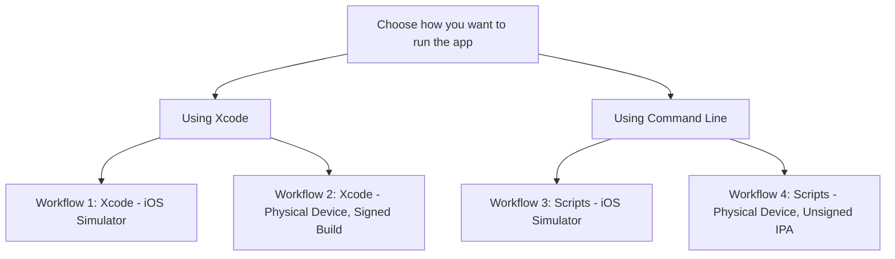

# Build Scripts for MASTestApp iOS

This file explains the available ways to build and run MASTestApp iOS. It covers both [Xcode-based workflows](#using-xcode) and [command line workflows](#using-command-line), so you can quickly choose the path that matches your setup. It also lists the helper scripts, explains what each workflow is for, and highlights the requirements and limitations you should know before you start.

These scripts are also used by the GitHub Actions CI workflows to keep local and CI build steps aligned. Specifically, CI calls them from `.github/workflows`. You can run the same scripts manually on your machine for local development, validation, and troubleshooting.



## Using Xcode

You can open the Xcode project and build or run the app directly from Xcode without using these scripts. This is the simplest option if you want to work entirely in Xcode. The scripts are provided as helpers for common tasks that are easier to automate from the command line.

See more information in [Running your app in Simulator or on a device](https://developer.apple.com/documentation/xcode/running-your-app-in-simulator-or-on-a-device).

### Workflow 1: Xcode - iOS Simulator

Use this workflow if you want to run the app in the iOS Simulator directly from Xcode.

Open the Xcode project, select an iOS Simulator as the run destination, then build and run the app.

### Workflow 2: Xcode - Physical Device, Signed Build

Use this workflow to run the app from Xcode on a real iPhone or iPad. Xcode can automatically manage signing, register the device, and create the development provisioning profile for you.

**Requirements:**

- Xcode installed on your Mac
- A physical iPhone or iPad connected to your Mac
- An Apple account added in Xcode
- Your Apple Developer Team ID

**Apple account requirement:**

A paid Apple Developer Program membership is not required to build and run the app on your own device from Xcode. A free Apple account, shown in Xcode as a Personal Team, is enough for local development and basic device testing. A paid membership is required for distribution features such as App Store release, TestFlight, Ad Hoc distribution, and other signing and provisioning features that are part of the Apple Developer Program.

**Limitations of a [free account](https://developer.apple.com/support/compare-memberships/):**

- Free provisioning is intended for personal development and testing
- Provisioning profiles expire after 7 days
- Registered App IDs are limited to 10 at a time, and each expires after 7 days
- Registered test devices are limited to 3 per platform, and each registration expires after 7 days
- When the provisioning profile expires, you must rebuild and reinstall the app from Xcode
- App distribution features are not available with a free account
- TestFlight, App Store distribution, and Ad Hoc distribution require a paid account

Also see [MASTG-TECH-0079: Obtaining a Developer Provisioning Profile](https://mas.owasp.org/MASTG/techniques/ios/MASTG-TECH-0079/).

**1. Create a local signing configuration:**

```bash
cp Local.xcconfig.example Local.xcconfig
```

**2. Edit `Local.xcconfig`:**

Set `DEVELOPMENT_TEAM` to your Apple Developer Team ID.

Example:

```xcconfig
DEVELOPMENT_TEAM = ABC123DEF4
```

**3. Open the project in Xcode and run it on your device:**

Select your connected device in Xcode, then press `Cmd+R`.

There is currently no script for creating a signed device build from the command line.

## Using Command Line

The command line scripts below are the same scripts used by GitHub Actions CI. CI runs them automatically in pull requests and branch builds through the workflow files in `.github/workflows/`, while you can run them manually on your Mac to reproduce CI behavior locally.

### Script Inventory

- `build-and-install-on-simulator.sh`: Builds the app for the iOS Simulator, boots a simulator, and installs the app
- `build-and-package.sh`: Builds an unsigned device archive, signs it with ldid, and packages it as an IPA
- `build-for-testing.sh`: Builds the app for testing, including XCTest and UI tests
- `common.sh`: Shared build functions used by the other scripts

### Workflow 3: Scripts - iOS Simulator

Use this workflow to run the app in the iOS Simulator from the command line.

**1. List available simulators:**

```bash
xcrun simctl list devices available
```

This shows the simulator names you can use, such as `iPhone 17`.

**2. Build the app, boot the simulator, and install it:**

```bash
./build-and-install-on-simulator.sh "iPhone 17"
```

This script automatically copies `Local.xcconfig.ci`, so no manual configuration is required.

**3. Launch the app:**

```bash
open -a Simulator
xcrun simctl launch booted org.owasp.mastestapp.MASTestApp-iOS
```

### Workflow 4: Scripts - Physical Device, Unsigned IPA

Use this workflow to generate an unsigned IPA for manual signing, sideloading, or use on a jailbroken device.

**Requirements:** Install `ldid` with `brew install ldid`

Run the script that builds an archive, signs it with `ldid`, and packages it as an IPA to `output/MASTestApp-unsigned.ipa`.

```bash
./build-and-package.sh
```

Optionally, set a **custom IPA name** and add **extra entitlements** (will be merged with the default entitlements) by passing arguments to the script:

```bash
./build-and-package.sh "MASTestApp-DEMO-0001.ipa" path/to/extra-entitlements.plist
```

You can install the IPA on a physical device by following [MASTG-TECH-0056: Installing Apps](https://mas.owasp.org/MASTG/techniques/ios/MASTG-TECH-0056/).
